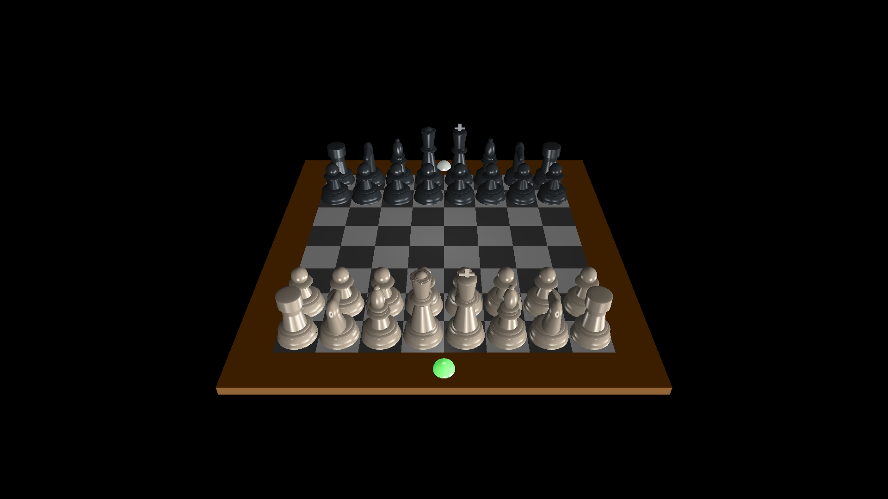
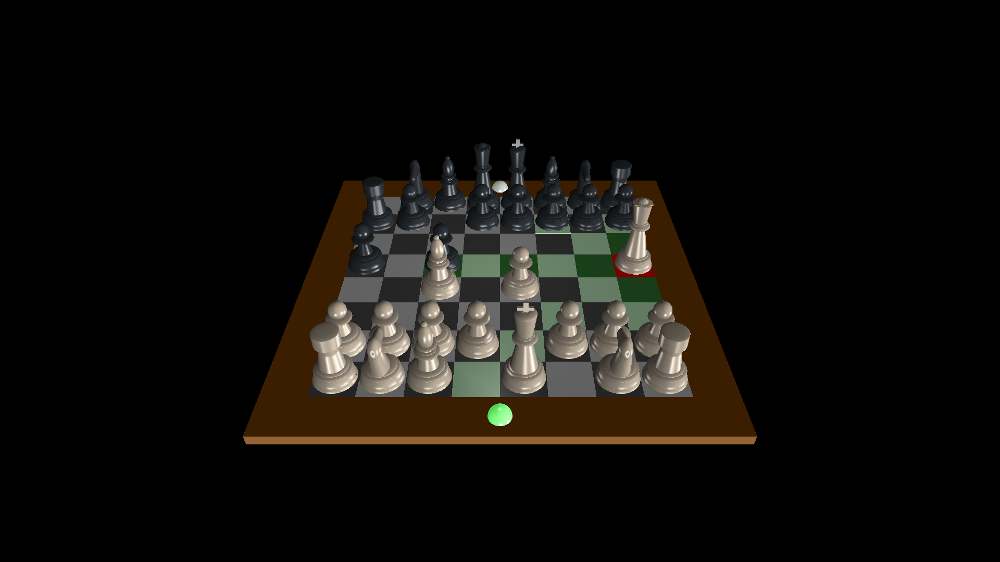

# Chess
Simple 3D chess program using OpenGL


## Functionalities
* Human vs Human
* Indicates current player
* Highlights valids positions for a selected piece
* 3 different light source
* Check and Checkmate indications

## Requirements
* C++ (latest)
* [OpenGL](https://www.khronos.org/opengl/wiki/Getting_Started#Downloading_OpenGL)
  * GLU
  * GLUT
  
## Usage
```shell
git clone https://github.com/Darshan-AS/chess.git
cd chess
g++ *.cpp -lm -lglut -lGL -lGLU -o chess
./chess
```

### Note
* Use `1, 2, 3` to toggle lights
* Use `LeftMouse` to interact
* Use `Esc` to quit

## Screenshots




